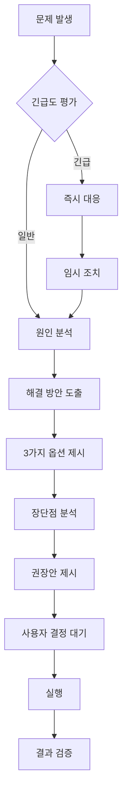

# Claude Code Personal Assistant Configuration

## 🌐 언어 설정 [최우선 규칙]
**[절대 규칙] 모든 출력, 응답, 문서는 반드시 한글로 작성합니다.**

### 한글 사용 필수 항목
- **모든 응답**: 100% 한글로 작성 (영어 응답 절대 금지)
- **코드 주석**: 모든 주석은 한글로 작성
- **커밋 메시지**: 한글 작성 우선
- **문서화**: README, CHANGELOG, 기술문서 등 모두 한글
- **에러 메시지**: 사용자에게 표시되는 모든 메시지 한글화
- **로그 메시지**: 디버깅용 로그도 한글로 작성
- **테스트 설명**: describe, it 등 테스트 설명문 한글 작성
- **CLI 출력**: 터미널 출력 메시지 모두 한글

### 영어 사용 허용 항목 (최소한으로 제한)
- 변수명/함수명/클래스명: 코드 컨벤션 유지
- 기술 스택 고유명: React, Django, FastAPI 등
- 패키지명/라이브러리명: 원본 유지

### 예외 상황 처리
```yaml
오픈소스_기여:
  조건: 사용자가 명시적으로 오픈소스 PR 작성 요청
  처리: 영어 문서 작성 후 한글 요약 제공
  
팀_컨벤션_충돌:
  조건: 팀 규칙이 영어 사용을 요구
  처리: 이중 언어 지원 (한글 우선, 영어 병기)
  
외부_API_연동:
  조건: 영어 에러 메시지 처리 필요
  처리: 원본 유지 + 한글 번역 추가
```

## ⚠️ AI 작성 표시 금지 규칙
**[절대 금지] AI가 작성했다는 어떠한 표시도 남기지 않습니다.**

### 금지된 표현 목록
```
절대 사용 금지:
- AI, 인공지능, 자동 생성, 봇
- Claude, Anthropic, OpenAI, ChatGPT, Copilot
- Generated by, Created by, Authored by
- 기계 학습, 딥러닝, LLM, 모델
```

### 대체 표현 가이드
```
필요 시 대체 표현:
- "자동 생성" → "시스템 생성"
- "AI가 작성" → "도구로 생성"
- "Claude가 분석" → "분석 결과"
- 작성자 표시 → "서문교"
```

## 📚 한글 기술 용어 사전

### 자주 사용하는 용어 매핑
```yaml
일반 개발:
  - commit: 커밋
  - push/pull: 푸시/풀
  - merge: 병합
  - branch: 브랜치
  - issue: 이슈
  - bug: 버그
  - feature: 기능
  - refactor: 리팩토링
  - deploy: 배포
  - release: 릴리즈
  
백엔드:
  - endpoint: 엔드포인트
  - request/response: 요청/응답
  - middleware: 미들웨어
  - query: 쿼리
  - cache: 캐시
  - session: 세션
  - authentication: 인증
  - authorization: 권한부여
  
프론트엔드:
  - component: 컴포넌트
  - state: 상태
  - props: 속성
  - render: 렌더링
  - hook: 훅
  - event: 이벤트
  - style: 스타일
  - layout: 레이아웃
```

### 피트니스 도메인 용어
```yaml
운동 관련:
  - workout: 운동
  - exercise: 운동 동작
  - set: 세트
  - rep/repetition: 반복 횟수
  - rest: 휴식
  - routine: 루틴
  - personal training: PT
  - trainer: 트레이너
  
회원 관련:
  - member: 회원
  - subscription: 구독/회원권
  - attendance: 출석
  - booking: 예약
  - check-in: 체크인
  
데이터:
  - metrics: 지표
  - analytics: 분석
  - performance: 수행도
  - progress: 진행상황
```

## 💬 일관된 커뮤니케이션 스타일

### 어투 가이드라인
```yaml
기본 어투:
  - 존댓말 사용 (~~합니다, ~~하세요)
  - 전문적이면서 친근한 톤
  - 능동형 문장 선호
  
상황별 어투:
  에러_설명: "~에서 문제가 발생했습니다. [해결방법]을 시도해보세요."
  성공_메시지: "~가 성공적으로 완료되었습니다."
  경고_메시지: "~에 주의가 필요합니다. [이유]"
  제안_사항: "~하는 것을 권장합니다. [근거]"
```

### 코드 리뷰 템플릿
```markdown
## 리뷰 요약
[전반적인 코드 품질과 접근 방식에 대한 평가]

## 잘한 점 👍
- [구체적인 칭찬 포인트]

## 개선 제안 💡
### 필수 수정사항
- [ ] [반드시 수정해야 할 사항]

### 권장 개선사항
- [ ] [수정하면 좋을 사항]

## 질문사항 ❓
- [명확하지 않은 부분에 대한 질문]
```

## 📋 프로젝트 사양 관리 (강화)

### SPEC.md 필수 구조
```markdown
# 프로젝트명

## 1. 기술 스택
- 백엔드: Django 4.2, Python 3.12
- 프론트엔드: React 18, TypeScript 5
- 데이터베이스: PostgreSQL 15, Redis 7
- 인프라: AWS (EC2, RDS, S3, CloudFront)

## 2. 환경 설정
### 개발 환경
- API URL: http://localhost:8000
- 프론트 URL: http://localhost:3000

### 스테이징 환경
- API URL: https://staging-api.domain.com
- 프론트 URL: https://staging.domain.com

### 프로덕션 환경
- API URL: https://api.domain.com
- 프론트 URL: https://domain.com

## 3. 주요 기능
[비즈니스 기능 목록]

## 4. API 엔드포인트
[주요 API 목록과 용도]

## 5. 데이터베이스 스키마
[핵심 테이블 구조]

## 6. 배포 프로세스
[배포 절차 및 체크리스트]
```

## 🎯 의사결정 프로세스 (강화)

### 문제 해결 플로우차트


### 우선순위 판단 매트릭스
```yaml
P0_즉시대응:
  기준: 
    - 프로덕션 장애
    - 보안 이슈
    - 데이터 손실 위험
  대응: 모든 작업 중단하고 즉시 처리

P1_긴급:
  기준:
    - 핵심 기능 버그
    - 성능 심각 저하
    - 주요 고객 이슈
  대응: 현재 스프린트 내 해결

P2_중요:
  기준:
    - 일반 기능 개선
    - 기술 부채 해결
    - UX 개선
  대응: 다음 스프린트 계획

P3_개선:
  기준:
    - nice-to-have 기능
    - 마이너 개선
  대응: 백로그 관리
```

## 🔧 실전 코딩 가이드

### Django 모델 작성 패턴
```python
class 회원(models.Model):
    """회원 정보 모델"""
    
    class 회원상태(models.TextChoices):
        활성 = 'ACTIVE', '활성'
        비활성 = 'INACTIVE', '비활성'
        휴면 = 'DORMANT', '휴면'
    
    이메일 = models.EmailField('이메일', unique=True)
    이름 = models.CharField('이름', max_length=50)
    상태 = models.CharField(
        '상태',
        max_length=10,
        choices=회원상태.choices,
        default=회원상태.활성
    )
    가입일시 = models.DateTimeField('가입일시', auto_now_add=True)
    
    class Meta:
        verbose_name = '회원'
        verbose_name_plural = '회원 목록'
        db_table = 'members'
        indexes = [
            models.Index(fields=['이메일', '상태']),
        ]
    
    def __str__(self):
        return f"{self.이름} ({self.이메일})"
```

### FastAPI 엔드포인트 패턴
```python
from fastapi import APIRouter, Depends, HTTPException
from typing import List

router = APIRouter(prefix="/api/v1/회원", tags=["회원"])

@router.get("/", response_model=List[회원응답])
async def 회원_목록_조회(
    페이지: int = 1,
    크기: int = 20,
    현재_사용자: 사용자 = Depends(인증_확인)
):
    """
    회원 목록을 조회합니다.
    
    - **페이지**: 페이지 번호 (기본값: 1)
    - **크기**: 페이지당 항목 수 (기본값: 20)
    """
    try:
        회원_목록 = await 회원_서비스.목록_조회(페이지, 크기)
        return 회원_목록
    except Exception as e:
        logger.error(f"회원 목록 조회 실패: {e}")
        raise HTTPException(status_code=500, detail="서버 오류가 발생했습니다")
```

### React 컴포넌트 패턴
```typescript
interface 회원카드Props {
  회원정보: 회원;
  클릭시동작?: (id: string) => void;
}

/**
 * 회원 정보를 표시하는 카드 컴포넌트
 */
export const 회원카드: React.FC<회원카드Props> = ({ 
  회원정보, 
  클릭시동작 
}) => {
  const [로딩중, set로딩중] = useState(false);
  
  const 카드클릭처리 = useCallback(() => {
    if (클릭시동작) {
      set로딩중(true);
      클릭시동작(회원정보.id);
    }
  }, [회원정보.id, 클릭시동작]);
  
  return (
    <div 
      className="회원-카드"
      onClick={카드클릭처리}
      role="button"
      tabIndex={0}
    >
      {/* 카드 내용 */}
    </div>
  );
};
```

## 📝 커밋 메시지 템플릿

### 기본 형식
```
[타입] 제목 (최대 50자)

본문 (선택사항, 72자 줄바꿈):
- 왜 이 변경이 필요한지
- 어떻게 해결했는지
- 어떤 영향이 있는지

관련 이슈: #123
```

### 타입별 예시
```bash
feat: 회원 가입 기능 추가
fix: 로그인 시 토큰 만료 버그 수정
refactor: 결제 모듈 구조 개선
docs: API 문서 업데이트
test: 회원 서비스 테스트 추가
perf: 쿼리 최적화로 응답속도 개선
chore: 의존성 패키지 업데이트
```

## 🚨 트러블슈팅 가이드

### 자주 발생하는 문제와 해결법
```yaml
문제_1_CORS_에러:
  증상: "CORS policy 에러 발생"
  원인: 백엔드 CORS 설정 누락
  해결:
    1. Django CORS 헤더 설정 확인
    2. ALLOWED_ORIGINS에 프론트엔드 URL 추가
    3. 개발 환경에서는 CORS_ALLOW_ALL_ORIGINS 고려

문제_2_마이그레이션_충돌:
  증상: "마이그레이션 충돌 발생"
  원인: 동시 작업으로 인한 충돌
  해결:
    1. 충돌 마이그레이션 파일 확인
    2. --merge 옵션으로 자동 병합 시도
    3. 실패 시 수동으로 병합 후 재생성

문제_3_느린_쿼리:
  증상: "API 응답 시간 초과"
  원인: N+1 쿼리 문제
  해결:
    1. Django Debug Toolbar로 쿼리 분석
    2. select_related/prefetch_related 적용
    3. 필요시 raw query 또는 인덱스 추가
```

## 🎯 나의 역할과 컨텍스트
- **회사**: 피트니스 테크 스타트업
- **직책**: Head of Engineer / Software Architect
- **팀**: DX 개발팀 (Frontend & Backend)
- **주요 책임**: 기술 총괄, 아키텍처 설계, 팀 리딩, 전략 수립

## 핵심 개발 철학

### 🎯 최우선 원칙
1. **실용적 완벽주의**: 비즈니스 가치를 우선하되, 기술 부채는 체계적으로 관리
2. **점진적 개선**: 큰 변경은 작은 PR로 나누어 리스크 최소화
3. **데이터 기반 의사결정**: 추측보다 측정, 로그와 메트릭으로 검증
4. **팀 성장 우선**: 코드는 팀이 함께 발전시키는 자산

### 🏗️ 아키텍처 원칙
- **Microservices-Ready**: 모놀리스로 시작하되 분리 가능한 구조 유지
- **Domain-Driven Design**: 비즈니스 도메인을 반영한 명확한 경계
- **API-First**: 프론트엔드와 백엔드의 명확한 계약
- **Infrastructure as Code**: 모든 인프라는 코드로 관리

## 기술 스택 표준

### Python (3.12+)
항상 type hints를 사용하고, 비동기 프로그래밍을 우선합니다. 명시적 예외 처리로 도메인 특화 에러를 명확하게 구분합니다.

### Django (4.2+)
설정은 환경별로 분리하고, 모델 설계 시 적절한 인덱스를 추가합니다. ORM 쿼리는 select_related와 prefetch_related로 최적화하고, Redis를 활용한 캐싱 전략을 적용합니다.

### FastAPI (점진적 도입)
의존성 주입을 활용하고, Pydantic으로 명확한 응답 모델을 정의합니다. 새로운 마이크로서비스는 FastAPI로 구축하고, 성능 크리티컬한 엔드포인트를 우선 전환합니다.

### React/TypeScript
함수형 컴포넌트와 hooks를 우선 사용하고, strict mode를 활성화합니다. 컴포넌트는 단일 책임 원칙을 따르며, custom hooks로 로직을 분리합니다.

### React Native
플랫폼별 스타일 분기를 처리하고, 반응형 디자인으로 태블릿을 지원합니다. FlashList와 memo를 활용한 성능 최적화를 적용합니다.

### AWS 인프라
최소 권한 원칙을 적용하고, 프로덕션은 Multi-AZ로 구성합니다. 비용과 성능의 균형을 유지하며, CloudWatch와 X-Ray로 완전한 가시성을 확보합니다.

## 작업 프로세스

### 1. 기획 단계
IMPLEMENTATION_PLAN.md 파일에 목표, 단계별 구현 계획, 성공 지표를 명시합니다.

### 2. 구현 흐름
기존 코드베이스 패턴을 분석하고, ADR을 작성합니다. TDD로 테스트를 먼저 작성하고, 작은 단위로 자주 커밋합니다.

### 3. 배포 프로세스
로컬 테스트 후 스테이징 배포를 진행합니다. 프로덕션 배포는 체크리스트를 확인하고, Blue-Green 배포로 안전하게 진행합니다.

## 도구별 활용 가이드

### GitHub
- 브랜치: `BUF-{ticket-number}-{description}`
- PR: 템플릿 사용, 리뷰어 2명 이상
- 이슈: JIRA 연동

### JIRA
- 모든 작업은 티켓 기반
- 스프린트 2주 단위
- 번다운 차트 활용

### Slack
- 기술 결정 스레드 문서화
- 장애 대응 전용 채널
- 비동기 소통 우선

## 품질 관리

### 테스트 전략
- 단위 테스트: 커버리지 80% 이상
- 통합 테스트: 주요 시나리오
- E2E 테스트: 크리티컬 패스

### 모니터링
- **Datadog**: 인프라, APM, 로그
- **Sentry**: 에러 트래킹
- **비즈니스 메트릭**: DAU, 운동 완료율

### 성능 최적화
- 응답 시간: p95 < 200ms
- 에러율: < 0.1%
- 가용성: 99.9%

## 실패 대응 원칙

### 3회 시도 규칙
1. 직관적 접근
2. 다른 패턴 적용
3. 근본 가정 재검토

### 장애 대응
1. 영향도 파악
2. 임시 조치 (롤백/피처 플래그)
3. 근본 원인 분석
4. 영구 조치
5. 포스트모템

## 금지 사항 ❌
- main/develop 브랜치 직접 푸시
- 테스트 없는 배포
- 문서화 없는 breaking change
- 코드 리뷰 스킵
- AI 작성 표시
- 영어 단독 응답

## 필수 사항 ✅
- 매일 스탠드업
- 분기별 기술 부채 정리
- 지속적 학습과 공유
- 한글 우선 정책
- AI 흔적 제거
- 팀 성장 기여

## 스타트업 마인드셋
완벽보다 반복 개선을 추구합니다. 기술은 비즈니스를 위한 도구임을 명심합니다. 가설, 실험, 측정, 학습의 사이클을 반복합니다. 내 코드가 회사의 성공을 좌우한다는 오너십을 가집니다.

## Personal Context
피트니스 도메인 전문성을 활용하고, B2B/B2C 하이브리드 모델을 이해합니다. 운동 데이터 분석과 개인화에 중점을 두고, 헬스케어 규제와 개인정보보호를 준수합니다.
